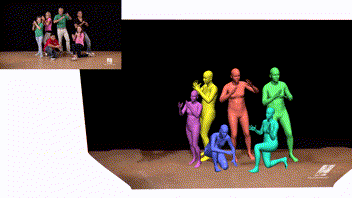
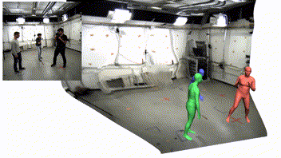
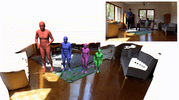
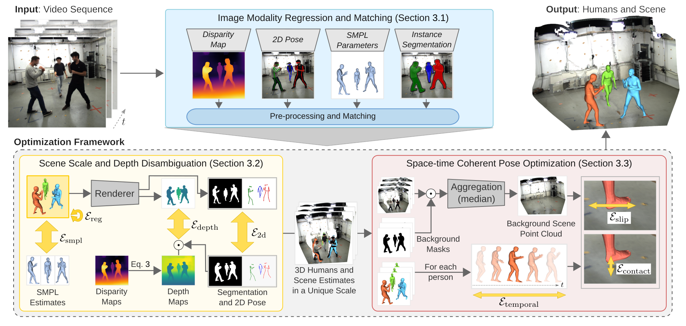
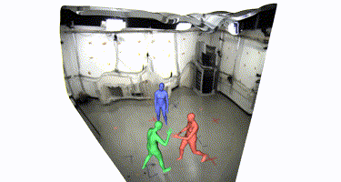

# Scene-Aware 3D Multi-Human Motion Capture

This software is released as part of the supplementary material of the paper:
> **Scene-Aware 3D Multi-Human Motion Capture from a Single Camera**, [EUROGRAPHICS 2023](https://eg2023.saarland-informatics-campus.de/)<br>
><a href="https://people.mpi-inf.mpg.de/~dluvizon" target="_blank">Diogo C. Luvizon</a> | <a href="https://people.mpi-inf.mpg.de/~mhaberma" target="_blank">Marc Habermann</a> |  <a href="https://people.mpi-inf.mpg.de/~golyanik" target="_blank">Vladislav Golyanik</a> | <a href="https://adamkortylewski.com" target="_blank">Adam Kortylewski</a> | <a href="http://people.mpi-inf.mpg.de/~theobalt" target="_blank">Christian Theobalt</a><br>
> **Project**: <a href="https://vcai.mpi-inf.mpg.de/projects/scene-aware-3d-multi-human/" target="_blank">https://vcai.mpi-inf.mpg.de/projects/scene-aware-3d-multi-human</a><br>
> **Code**: [https://github.com/dluvizon/scene-aware-3d-multi-human](https://github.com/dluvizon/scene-aware-3d-multi-human)

<div align="center">
<table>
  <tr>
    <td></td>
    <td></td>
    <td></td>
  </tr>
</table>
</div>

## Abstract

<div style="text-align: justify">In this work, we consider the problem of estimating the 3D position of multiple humans in a scene as well as their body shape and articulation from a single RGB video recorded with a static camera. In contrast to expensive marker-based or multi-view systems, our lightweight setup is ideal for private users as it enables an affordable 3D motion capture that is easy to install and does not require expert knowledge. To deal with this challenging setting, we leverage recent advances in computer vision using large-scale pre-trained models for a variety of modalities, including 2D body joints, joint angles, normalized disparity maps, and human segmentation masks. Thus, we introduce the first non-linear optimization-based approach that jointly solves for the 3D position of each human, their articulated pose, their individual shapes as well as the scale of the scene. In particular, we estimate the scene depth and person scale from normalized disparity predictions using the 2D body joints and joint angles. Given the per-frame scene depth, we reconstruct a point-cloud of the static scene in 3D space. Finally, given the per-frame 3D estimates of the humans and scene point-cloud, we perform a space-time coherent optimization over the video to ensure temporal, spatial and physical plausibility. We evaluate our method on established multi-person 3D human pose benchmarks where we consistently outperform previous methods and we qualitatively demonstrate that our method is robust to in-the-wild conditions including challenging scenes with people of different sizes.</div>



## 1. Installation

### 1.1 HW/SW Requirements

This software was tested on the following systems:
```bash
Operating System: Debian GNU/Linux 10; Ubuntu 20.04.5 LTS
GPU: TITAN V 12Gi; Quadro RTX 8000 48Gi
CPU-only is also supported (very slow)
CPU-RAM: 11 Gi
Python 3 and (Mini)Conda
```

### 1.2 Minimal setup

A minimal installation is possible by simply creating a new conda environment. This assumes that the input data modalities are pre-computed and available.

**1.2.1 Create a conda environment**
```bash
conda env create -f environment.yml
conda activate multi-human-mocap
```

Note that some packages in `environment.yml` are only needed for visualizations.

**1.2.2 Download Human Model and Body Joint Regressors**

We use the SMPL model that can be downloaded from [ [here](https://smpl.is.tue.mpg.de/) ]. Download the file `SMPL_NEUTRAL.pkl` and place it at `model_data/parameters`.

### 1.3 Pre-processing and Image Predictors
_<This step is only required for [predictions from new videos](#3-predictions-from-new-videos)>_

Our method relies on four different predictors as input data modalities. Please follow the **optional instructions** [ [here](doc/external_tools.md) ] to install and setup each predictor. **As an alternative**, one could also install the predictors by their own. Here is a list of each predictor that we use:
  - Monocular Depth Estimation: [MiDaS/DPT](https://github.com/isl-org/DPT)
  - 2D Human Pose Estimation and Tracking: [AlphaPose](https://github.com/MVIG-SJTU/AlphaPose)
  - Initial SMPL Parameters: [ROMP](https://github.com/Arthur151/ROMP)
  - Instance Segmentation: [Mask2Former](https://github.com/facebookresearch/Mask2Former)

All the predictors are independent and can be installed and executed in parallel. Note that all these predictors are not part of our software distribution, although we provide [simplified instructions](doc/external_tools.md) on how to install and adapt, if necessary.


## 2. Evaluation on MuPoTs-3D

2.1 First, download MuPoTs-3D and rearrange the data:
```bash
mkdir -p data && cd data
wget -c http://gvv.mpi-inf.mpg.de/projects/SingleShotMultiPerson/MultiPersonTestSet.zip
unzip MultiPersonTestSet.zip
for ts in {1..20}; do
  mkdir -p mupots-3d-eval/TS${ts}/images
  mv MultiPersonTestSet/TS${ts}/* mupots-3d-eval/TS${ts}/images/
done
rm -r MultiPersonTestSet
```

2.2 For the sequences from MuPoTs-3D, we provided the pre-processed data required to run our software. Please download it from [ [here](https://vcai.mpi-inf.mpg.de/projects/scene-aware-3d-multi-human/data/mhmc_mupots-3d-eval.tar.bz2) ] and place the file in `data/`. Then, extract it with:
```bash
tar -jxf mhmc_mupots-3d-eval.tar.bz2
```
After this, the folder `data/mupots-3d-eval` should have the follow structure:
```
  |-- data/mupots-3d-eval/
      |-- TS1/
          |-- AlphaPose/
              |-- alphapose-results.json
          |-- DPT_large_monodepth/
              |-- img_%06d.png
          |-- images/
              |-- img_%06d.jpg
              |-- annot.mat
              |-- intrinsics.txt
              |-- occlusion.mat
          |-- Mask2Former_Instances/
              |-- img_%06d.png
          |-- ROMP_Predictions/
              |-- img_%06d.npz
      |-- TS2/
          [...]
```

2.3 With the [minimal installation](#minimal-setup) done and the MuPoTs-3D data is ready, run:
```bash
./script/predict_mupots_full.sh
```
This runs the optimization in the full dataset (TS1..TS20) and can take a long time, depending on the hardware config. For a quick test of the software, run:
```bash
./script/predict_mupots_test.sh # TS1 only, only a few iterations
```

After running the prediction part for the full dataset, the output will be stored in `./output`.

2.4 Compute the scores from the predicted outputs.
```bash
./script/eval_mupots.sh
cat output/mupots/FinalResults.md # show our results
```

## 3. Predictions from New Videos

Processing new videos requires all the predictors to be installed. If not done yet, please follow [this step](#13-pre-processing-and-image-predictors). For a new video, please extract it (using ffmpg or a similar tool) to `[path_to_video]/images/img_%06d.jpg`.

**3.1 Preprocess video frames**

Run the script:
```bash
# path_to_video="path-to-your-video-file"
./script/preproc_data.sh ${path_to_video}
```
After this, the folder `[path_to_video]/` should contain all the preprocessed outputs (depth maps, 2d pose, SMPL parameters, segmentation).

**3.2 Run our code**

```bash
./script/predict_internet.sh ${path_to_video} ${path_to_video}/output
```
This script calls `mhmocap.predict_internet.py`, which assumes a standard camera with FOV=60. Modify it if you need to properly set the camera intrinsics.

## 4. Iterative 3D Visualization

We provide a visualization tool based on Open3D. This module can show our predictions in 3D for a video sequence in an interactive way:
```bash
python -m mhmocap.visualization \
  --input_path="${path_to_video}/output" \
  --output_path="${path_to_video}/output"
```
<div align="center">
<table>
  <tr>
    <td></td>
  </tr>
</table>
</div>
Type "n" to jump to the next frame and "u" to see it from the camera perspective.

## Citation

Please cite our paper if this software (including any part of it) is useful for you.
```bibtex
@misc{SceneAware_EG2023,
  title = {{Scene-Aware 3D Multi-Human Motion Capture from a Single Camera}},
  author = {Luvizon, Diogo and Habermann, Marc and Golyanik, Vladislav and Kortylewski, Adam and Theobalt, Christian},
  doi = {10.48550/ARXIV.2301.05175},
  url = {https://arxiv.org/abs/2301.05175},
  publisher = {arXiv},
  year = {2023},
}
```

## License

***REMOVED***


## Acknowledgment

This work was funded by the **ERC Consolidator Grant 4DRepLy (770784)**.

Some parts of this code were borrowed from many other great repositories, including [ROMP](https://github.com/Arthur151/ROMP), [VIBE](https://github.com/mkocabas/VIBE), and more. We also thank [Rishabh Dabral](https://www.cse.iitb.ac.in/~rdabral/) for his special help in the animated characters with Blender.
